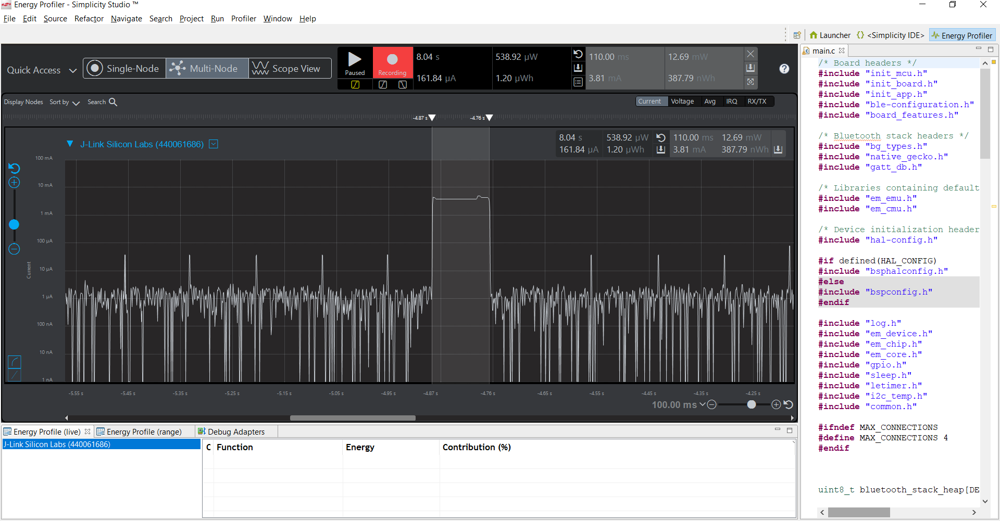

Please include your answers to the questions below with your submission, entering into the space below each question
See [Mastering Markdown](https://guides.github.com/features/mastering-markdown/) for github markdown formatting if desired.

*Be sure to take measurements in the "Default" configuration of the profiler to ensure your logging logic is not impacting current/time measurements.*

*Please include screenshots of the profiler window detailing each current measurement captured.  See [Shared document](https://docs.google.com/document/d/1Ro9G2Nsr_ZXDhBYJ6YyF9CPivb--6UjhHRmVhDGySag/edit?usp=sharing) for instructions.* 

1. What is the average current per period?
   Answer: 144.04uA
    Screenshot:  
     

2. What is the average current when the Si7021 is Load Power Management OFF?
   Answer: 1.68uA
    Screenshot:  
     

3. What is the average current when the Si7021 is Load Power Management ON?
   Answer: 3.81 mA
    Screenshot:  
     

4. How long is the Si7021 Load Power Management ON for 1 temperature reading?
   Answer: 110 mS
    Screenshot:  
     

5. What is the total operating time of your design for assignment 4 in hours assuming a 1000mAh supply?
   Answer:   the average current consumption is 144.04uA. so, operating time = capacity/current drawn.
              => time = 1000mA/144uA.
                      = 6944 hrs
6. How has the power consumption performance of your design changed since the previous assignment?
   Answer:  the current consumption during LPM ON has decreased and this lead to the overall the current consumption to decrease.
            This can be seen as the effect of sleeping for more time in EM1 through the state machine and interrupt based implementation
            of I2C.

7. Describe how you have tested your code to ensure you are sleeping in EM1 mode during I2C transfers.
   Answer: i have placed a break point in the sleep_sleep function near EM1 to check if the lowest possible mode is set to EM1 and 
           if the function is executing Em1 loop and waiting. Also i observed the currents in the energy profiler and noticed they are in EM1.
